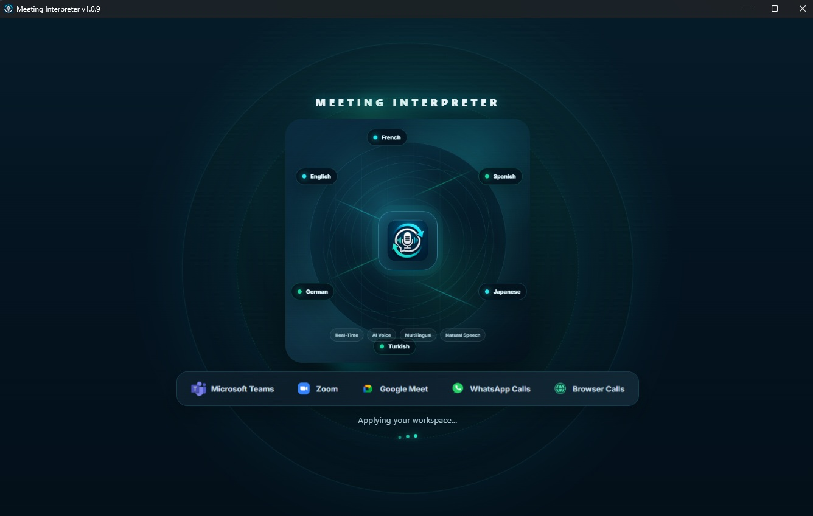
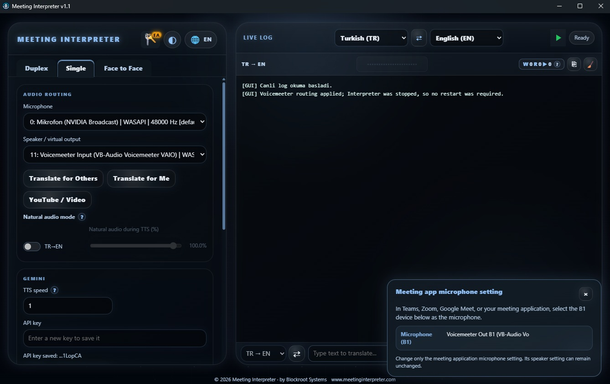
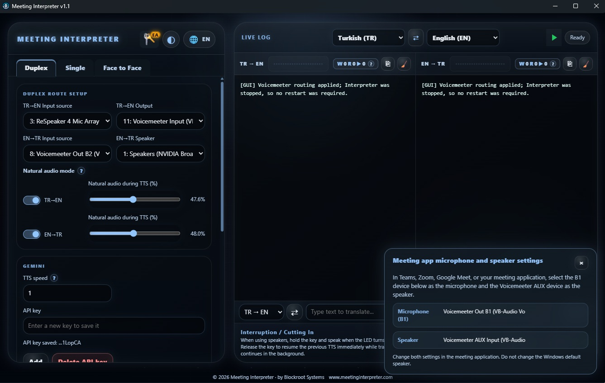
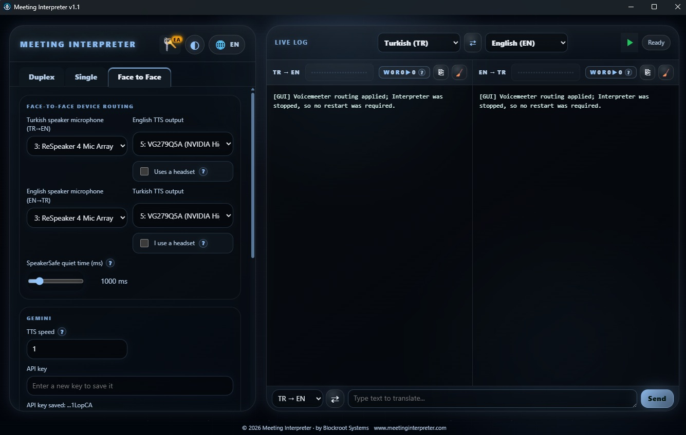

# Meeting Interpreter

**Real-time AI voice translation for Windows** 🎙️🌍

Meeting Interpreter helps people communicate across languages during **online meetings** and **face-to-face conversations**. It focuses on natural spoken communication, clear audio routing, and translated voice playback rather than subtitles alone.

> **Official download:** [Get Meeting Interpreter on Microsoft Store](https://apps.microsoft.com/detail/9NKS36FFS2R6) (under certification)

> **Website:** [meetinginterpreter.com](https://meetinginterpreter.com)

> **Built for:** Windows 10/11 64-bit

> **Early access:** Currently open for users who want to try the latest build.

> **Windows Release v1.1.0:** [Download the installer](https://github.com/meetinginterpreter/meeting-interpreter/releases/download/v1.1.0/MeetingInterpreter_v1.1_Setup.exe)

---

## Overview

Meeting Interpreter is built for practical multilingual communication in business and everyday use.

It can be used during calls and meetings on platforms such as:

- Microsoft Teams
- Zoom
- Google Meet
- WhatsApp Calls
- Browser-based calling platforms

It also supports **in-person communication** with a dedicated **Face to Face** workflow.

## Why It Stands Out

- 🎤 **Natural AI voice output** for translated responses
- ↔️ **Two-way live translation** for both sides of a conversation
- 🧭 **Smart audio routing** for microphones, speakers, and virtual devices
- 🏢 **Two conversation environments**: online meetings and face-to-face use
- ⚡ **Real-time workflow** designed for live speech, not just text

---

## Screenshots

### Welcome Screen

### Single Mode

Use one-way interpretation when you want to translate from one speaker to another direction.

### Duplex Mode

Use duplex mode for natural two-way conversations with separate routing for both directions.

### Face to Face Mode

Use face-to-face mode for in-person multilingual communication.

---

## Key Features

- **Real-time speech translation** for live communication
- **Natural AI voice playback** for translated speech
- **Single Mode** for one-way interpretation
- **Duplex Mode** for two-way conversations
- **Face to Face Mode** for in-person communication
- **Flexible audio routing** for microphones, speakers, and virtual audio devices
- **Live log panel** for operational visibility
- **Text input support** for typed translation workflows
- **Windows desktop experience** designed for practical day-to-day use

---

## Typical Use Cases

### Online Meetings
Use Meeting Interpreter during online meetings to help participants communicate across languages.

### Customer Communication
Support multilingual conversations in demos, calls, or service interactions.

### Internal Team Collaboration
Reduce language barriers in distributed and international teams.

### Face-to-Face Conversations
Enable in-person spoken communication between different language speakers.

### Training and Demos
Use it to show multilingual conversations in product demos, workshops, or onboarding sessions.

---

## How It Works

From speech to translated voice in four steps:

1. 🎧 **Listen** - capture speech from the selected microphone or meeting audio source
2. 🧠 **Understand** - process words, language, and conversational context in real time
3. 🌐 **Translate** - generate a natural target-language response
4. 🔊 **Speak** - play the translation through the correct physical or virtual device

---

## Platform

- **Operating System:** Windows
- **Distribution:** Microsoft Store

## Setup Notes

Meeting Interpreter is designed to work smoothly with the app setup flow and the included voice-routing workflow.

- Use the Microsoft Store or website installer to get started
- Prepare your audio routing setup if you use virtual devices
- Add your AI service key during first-time configuration

## Certification Status

- Submission ✅
- Pre-processing ✅
- Certification ⏳
- Publishing ⬜

---

## Important Note

This repository is used for **product information, visuals, and official links**.

**Source code is not distributed through this repository.**

If you want to install the application, please use the official Microsoft Store link above.

---

## Official Links

- **Microsoft Store:** [https://apps.microsoft.com/detail/9NKS36FFS2R6](https://apps.microsoft.com/detail/9NKS36FFS2R6)
- **Website:** [https://meetinginterpreter.com](https://meetinginterpreter.com)
- **Tutorials:** [https://www.meetinginterpreter.com/](https://www.meetinginterpreter.com/)

---

## Suggested GitHub Topics

If you want to add repository topics on GitHub, these are good starting options:

`meeting-interpreter`, `real-time-translation`, `speech-translation`, `voice-translation`, `live-translation`, `speech-to-text`, `text-to-speech`, `multilingual`, `video-conferencing`, `windows`, `microsoft-store`, `accessibility`

---

## Publisher

**Blockroot Systems**

---

## Short Pitch

Meeting Interpreter makes multilingual conversations feel natural by turning live speech into translated voice in real time. It is built for teams, meetings, and face-to-face communication. ✨
